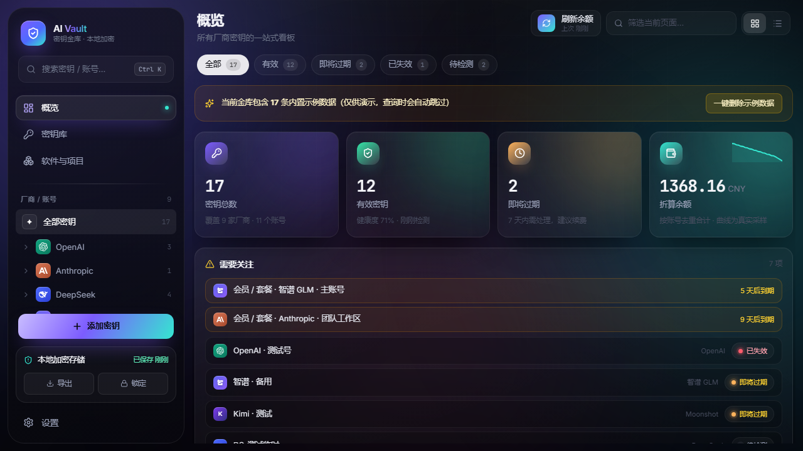
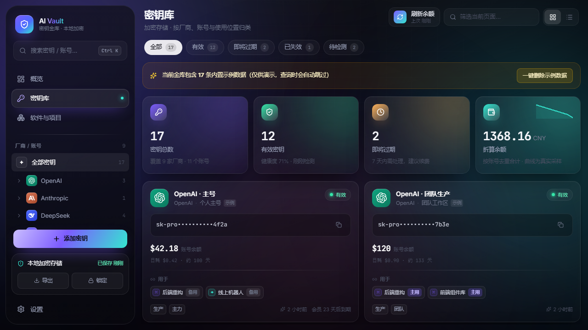
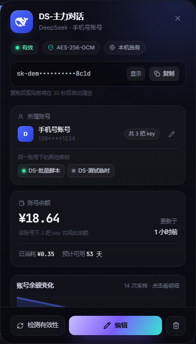
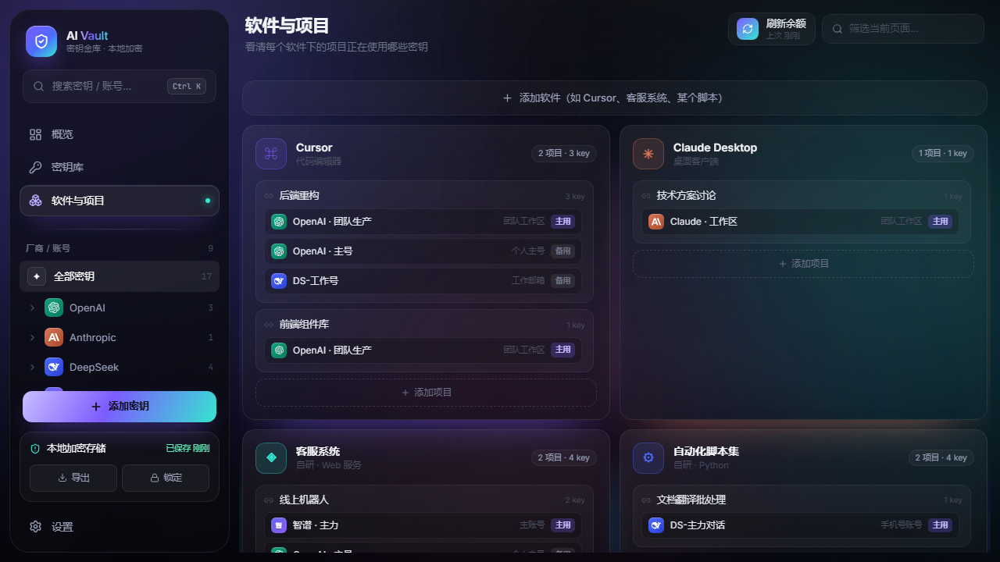
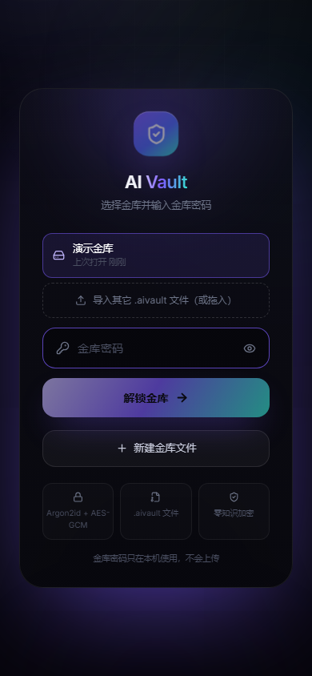
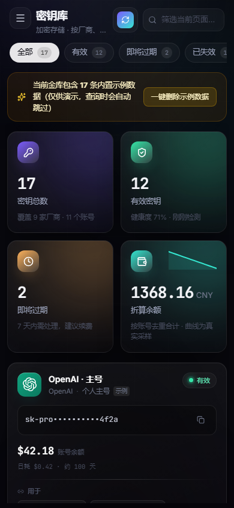

<div align="center">


[简体中文](README.md) | **English**

<br />

<a href="https://github.com/kllber/ai-vault/releases/latest">
  
</a>

</div>

---

# AI Vault

A **local-first, end-to-end encrypted** manager for AI API keys. Keep keys from many providers in a
single encrypted `.aivault` file, and see at a glance **which project uses which key, whether it still
works, and how much balance is left**.

Data stays on your machine (or in your own vault file). The vault password is stretched with
**Argon2id** and data is encrypted with **AES-256-GCM**; plaintext keys never touch disk and are never
uploaded.

> **中文：** AI Vault 是一个本地优先、端到端加密的 AI API 密钥管理工具。密钥存在一个加密的
> `.aivault` 文件里（Argon2id + AES-256-GCM）。它记录「哪个项目用哪把 key / 是否有效 / 余额与花费」，
> 桌面版内置本地服务，手机浏览器可经局域网或 Tailscale 使用。支持 Windows 10/11，无需额外运行库。

---

## 🖥 Overview · one dashboard for everything

<p align="center"></p>

Stat cards (total keys / valid / expiring / balance in CNY), a **needs-attention** list (membership
expiry, invalid or expiring keys), and a **per-account balance overview**. Every number comes from real
queries — no fake data.

---

## 🔑 Keys · copy and inspect anytime

<p align="center"></p>

Grid or list view, filter/search by provider, account or status. Each card shows the **account balance,
daily burn, and estimated days left**, with one-click copy (**the clipboard is cleared after 30s**).

---

## 🔎 Key detail · account, balance and where it is used

<p align="center"></p>

Click any key → a side panel with the **owning account**, the other keys in that account, the
**account balance** (shared within the account), a **real balance-history chart**, and
**check validity / edit / delete**.

---

## 🗂 Software & Projects · see where each key is used

<p align="center"></p>

Grouped by `Software → Project`: which projects each software has, and which keys (as
**primary / backup**) each project is using. You can search and bind keys right from the project editor.

---

## 📱 Mobile · just a phone browser

<p align="center">
  
  
</p>

The desktop app ships a **built-in local service**: open it from a phone browser on the same Wi-Fi and
you get the full UI, sharing the **same data** with the desktop (the password is still decrypted on the
phone). With **Tailscale** (free) it also works **across networks / remotely**. Supports
"Add to Home Screen".

---

## ✨ Features

- **Encrypted storage** — AES-256-GCM with an Argon2id-derived key (64 MiB / 3 passes); plaintext keys only in memory while unlocked.
- **Hierarchical model** — `Provider → Account → Key`, usage side `Software → Project`, linked with `primary / backup` roles.
- **Balance & spend** — DeepSeek / Moonshot / OpenRouter / SiliconFlow directly; OpenAI / Anthropic via an Admin key; Qwen (通义千问) via its official CLI.
- **Validity checks** — probe each key against a free endpoint.
- **Balance snapshots** — recorded only when the balance changes, so trends and burn-rate are real.
- **The vault is a file** — one `.aivault` file (PSD-like), written immediately and again before exit.
- **Background / launch at login** — closing the window minimizes to the tray; autostart toggle in Settings.
- **File icon** — double-click a `.aivault` to open it in the app.
- **Portable** — an unzipped folder runs on any Windows PC.

---

## ⬇️ Download

Get `AI-Vault-v1.0.0-win-x64.zip` from [**Releases**](https://github.com/kllber/ai-vault/releases/latest):

1. Unzip to any **writable** folder (avoid `C:\Program Files`).
2. Run `AI Vault.exe`.
3. If Windows SmartScreen warns ("unknown publisher"), click **More info → Run anyway** (the build is unsigned).

> No .NET / Node / Python needed — the Electron runtime is bundled.

## 🔐 Security

- Argon2id + AES-256-GCM; plaintext keys are never written to disk.
- Clipboard auto-clears 30s after copying; auto-lock after 10 minutes idle.
- The vault password never leaves your machine. No telemetry.

## 🛠 Development

```bash
npm install
npm run dev          # dev server (HMR)
npm run build        # type-check + build to dist/
npm run app:build    # build the desktop folder → release/win-unpacked
npm run app          # run Electron directly
node cli/aivault.mjs selftest   # CLI end-to-end self-test
```

Stack: React 19 + TypeScript + Vite, Tailwind CSS v4, Zustand, Electron.

## 📄 License

Licensed under the **Apache License 2.0** — see [LICENSE](LICENSE). Third-party notices in [THIRD-PARTY-NOTICES.md](THIRD-PARTY-NOTICES.md).
